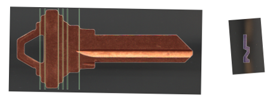
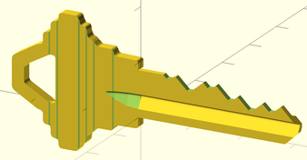

# keygen
Tools for generating physical keys.

## How it Works
1. Get some nice pictures of the side and tip of your key.
I recommend a flatbed scanner.
2. Trace the key outline, warding, and engraving in Inkscape
3. Use the provided Inkscape plugin to convert the paths to OpenSCAD polygons.
4. Look up online the various parameters of your key, such as plug diameter,
cut depths and locations.
5. Use the provided OpenSCAD functions `key_code_to_heights`,
`key_blank` and `key_bitting` to generate a 3D model of your key.
6. Send the key to be 3D printed.

## Music

There is no keygen music yet, in the meantime, try [here](https://soundcloud.com/dualtrax/sets/orion-keygen-music)
